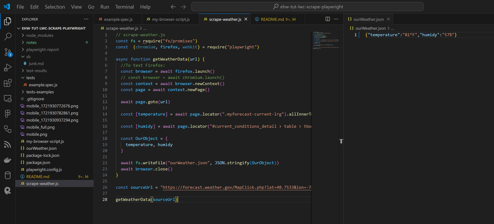

| INFO PROPERTY | VALUE                                          |
| ------------- | ---------------------------------------------- |
| Program Name  | **TUTWRK: LearnWebCode - Web Scraping, Screenshotting and Automated Testing Playwright Tutorial** |
| File Name     | README.md                                      |
| Date Created  | 07/25/24                                       |
| Date Modified | --                                             |
| Version       | 00.01.00                                       |
| Programmer    | **Eric Hepperle**                              |

### GITHUB REPO

- https://github.com/codewizard13/ehw-tut-lwc-playwright

### TECHNOLOGIES


<br><br>

**VSCODE: scrape-weather.js, ourWeather.json**:




## TAGS

`JavaScript` `Async-Await` `Playwright` `Coding` `Scraping`


## PURPOSE

Learn to use Playwright to automate our scraping, screenshotting, and testing needs by following tutorial by YouTube channel **[LearnWebCode](https://www.youtube.com/@LearnWebCode)**.


### Tutorial Info

Tutorial Info:
- Title: Web Scraping, Screenshotting and Automated Testing Playwright Tutorial
- Full URL: https://www.youtube.com/watch?v=tLU4GZHZBYk&t=14s&ab_channel=LearnWebCode
- Base URL: https://www.youtube.com/watch?v=tLU4GZHZBYk
- Channel: LearnWebCode
- Channel URL: https://www.youtube.com/@LearnWebCode
- Avatar URL: https://yt3.ggpht.com/ytc/AIdro_n6R7J2xrV33Fiqh68fKvoqUgtsPU3SYYeyOFwT6tx3Kg=s88-c-k-c0x00ffffff-no-rj


## PLUGINS & DEPENDENCIES

- **Playwright**: enables reliable end-to-end testing for modern web apps
- **NodeJS**: Node.js lets developers use JavaScript to write command line tools and for server-side scripting

## USAGE

- Type `node` then the name of the script:

```js
node scrape-weather.js

node my-browser-script.js
```

## NOTES

Notes are located in [./notes/main.md](./notes/main.md)

## RESOURCES & REFERENCE

- https://www.freecodecamp.org/news/git-reverting-to-previous-commit-how-to-revert-to-last-commit/